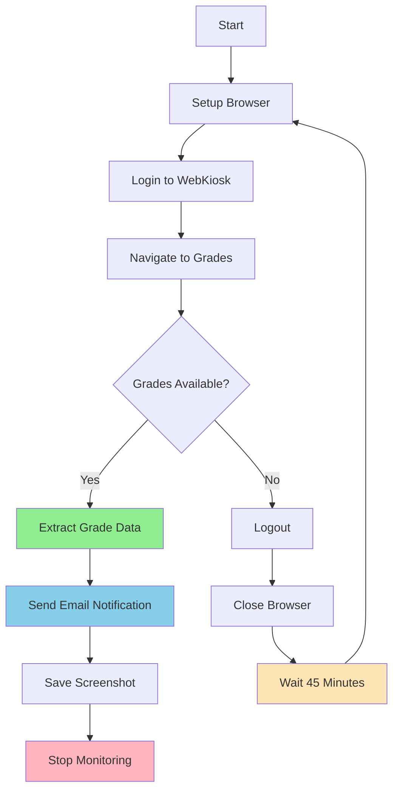

# Thapar University Grade Monitor 🎓

<div align="center">


**An intelligent automation tool that monitors Thapar University WebKiosk for grade releases and sends instant notifications**

[Features](#features) • [Installation](#installation) • [Usage](#usage) • [Configuration](#configuration) • [Troubleshooting](#troubleshooting)

</div>

---

## 📊 Project Stats

```
🔄 Check Interval:     45 minutes
⚡ Response Time:      < 2 minutes after grade release
📧 Notification:       Instant email alerts
🤖 Automation Level:   100% hands-free
💾 Storage:            Logs + Screenshots
```

## ✨ Features

<table>
<tr>
<td width="50%">

### 🚀 Core Functionality
- ✅ **Automated Login** - Secure credential management
- ✅ **Continuous Monitoring** - 24/7 grade checking
- ✅ **Fresh Sessions** - Clean browser restarts every cycle

</td>
<td width="50%">

### 📬 Notifications & Logging
- ✅ **Email Alerts** - Formatted HTML notifications
- ✅ **Data Extraction** - Structured grade parsing
- ✅ **Comprehensive Logs** - Debug-ready logging
- ✅ **Auto-Stop** - Stops after successful notification

</td>
</tr>
</table>

## 🎯 How It Works



## 📈 Monitoring Workflow

```
┌─────────────────────────────────────────────────────────────┐
│  Cycle 1: Check #1                                          │
│  ├─ Login ✓                                                 │
│  ├─ Navigate ✓                                              │
│  ├─ Check Status: Not Released                             │
│  ├─ Logout ✓                                                │
│  └─ Wait 45 min...                                          │
├─────────────────────────────────────────────────────────────┤
│  Cycle 2: Check #2                                          │
│  ├─ Login ✓                                                 │
│  ├─ Navigate ✓                                              │
│  ├─ Check Status: Not Released                             │
│  ├─ Logout ✓                                                │
│  └─ Wait 45 min...                                          │
├─────────────────────────────────────────────────────────────┤
│  Cycle N: Check #N                                          │
│  ├─ Login ✓                                                 │
│  ├─ Navigate ✓                                              │
│  ├─ Check Status: ✓ GRADES FOUND!                          │
│  ├─ Send Email ✓                                            │
│  ├─ Screenshot ✓                                            │
│  └─ STOP (Mission Complete) 🎉                              │
└─────────────────────────────────────────────────────────────┘
```

## 🛠️ Tech Stack

<div align="center">

| Technology | Purpose | Version |
|:----------:|:-------:|:-------:|
|  | Core Language | 3.7+ |
|  | Browser Automation | 4.0+ |
|  | Web Browser | Latest |
|  | Email Service | SMTP |

</div>

## 📦 Installation

### Prerequisites


### Step 1: Clone Repository

```bash
git clone https://github.com/AryanGanesh/thapar-grade-monitor.git
cd thapar-grade-monitor
```

### Step 2: Install Dependencies

```bash
pip install -r requirements.txt
```

Or install manually:
```bash
pip install selenium webdriver-manager python-dotenv
```

### Step 3: Configure Environment

Create a `.env` file in the project root:

```env
INSTITUTE_USERNAME=your_student_id
INSTITUTE_PASSWORD=your_password
INSTITUTE_URL=https://webkiosk.thapar.edu
EMAIL_FROM=your_email@gmail.com
EMAIL_PASSWORD=your_gmail_app_password
EMAIL_TO=recipient@email.com
```

> ⚠️ **Security Note**: Never commit your `.env` file to version control!

## 🔐 Gmail App Password Setup

<details>
<summary>Click to expand setup instructions</summary>

1. **Enable 2-Step Verification**
   - Go to [Google Account Security](https://myaccount.google.com/security)
   - Enable 2-Step Verification if not already active

2. **Generate App Password**
   - Navigate to [App Passwords](https://myaccount.google.com/apppasswords)
   - Select "Mail" and "Other (Custom name)"
   - Enter "Thapar Grade Monitor"
   - Click "Generate"

3. **Copy Password**
   - Copy the 16-character password (format: `xxxx xxxx xxxx xxxx`)
   - Paste into `EMAIL_PASSWORD` in your `.env` file

</details>

## ⚙️ Configuration

### Environment Variables

| Variable | Description | Example | Required |
|----------|-------------|---------|:--------:|
| `INSTITUTE_USERNAME` | Your Thapar student ID | `102103456` | ✅ |
| `INSTITUTE_PASSWORD` | WebKiosk password | `YourPass123` | ✅ |
| `INSTITUTE_URL` | Portal URL | `https://webkiosk.thapar.edu` | ✅ |
| `EMAIL_FROM` | Sender Gmail address | `you@gmail.com` | ✅ |
| `EMAIL_PASSWORD` | Gmail app password | `xxxx xxxx xxxx xxxx` | ✅ |
| `EMAIL_TO` | Recipient email | `you@gmail.com` | ✅ |

### Customization Options

#### Change Check Interval

```python
# In grade_monitor.py
CHECK_INTERVAL = 45 * 60  # Default: 45 minutes

# Options:
CHECK_INTERVAL = 30 * 60  # 30 minutes
CHECK_INTERVAL = 60 * 60  # 1 hour
```

#### Change Semester

```python
# In grade_monitor.py (line 164)
semester_select.select_by_value("2526ODDSEM")

# Change to your semester code
semester_select.select_by_value("YOUR_SEMESTER_CODE")
```

## 🚀 Usage

### Basic Usage

```bash
python grade_monitor.py
```

### Run in Background (Linux/Mac)

```bash
nohup python grade_monitor.py > output.log 2>&1 &
```

### Run in Background (Windows)

```powershell
pythonw grade_monitor.py
```

### Expected Output

```
============================================================
Thapar University Grade Monitor Starting
============================================================
Username: 102103456
Portal: https://webkiosk.thapar.edu
Check interval: 45 minutes
Notification email: your@email.com
============================================================

2025-01-11 10:30:00 - INFO - Setting up Chrome browser...
2025-01-11 10:30:05 - INFO - Browser ready
2025-01-11 10:30:10 - INFO - Login successful
2025-01-11 10:30:15 - INFO - Navigating to grade card section...
2025-01-11 10:30:20 - INFO - Successfully navigated to grade card page
2025-01-11 10:30:25 - INFO - Checking grade status...
2025-01-11 10:30:28 - INFO - Status: Grades not yet released
2025-01-11 10:30:30 - INFO - ✓ Logout successful
2025-01-11 10:30:32 - INFO - Browser closed
2025-01-11 10:30:32 - INFO - Next check in 45 minutes...
```

## 📧 Email Notification Preview

When grades are released, you'll receive a professionally formatted email:

```
┌─────────────────────────────────────────────────┐
│  🎓 Thapar University - Grades Released!        │
├─────────────────────────────────────────────────┤
│  Checked at: 2025-01-11 14:30:45                │
├─────────────────────────────────────────────────┤
│  Subject Code │ Subject Name      │ Grade │ ... │
│  UCS123       │ Data Structures   │ A     │ ... │
│  UMA456       │ Mathematics-II    │ A+    │ ... │
│  UPH789       │ Physics Lab       │ B+    │ ... │
└─────────────────────────────────────────────────┘
```

## 📊 Logging & Monitoring

### Log Levels


### Log Files

- **`grade_monitor.log`** - Persistent log file
- **Console Output** - Real-time monitoring

### Screenshots

| Screenshot | When Created | Purpose |
|------------|-------------|---------|
| `grades_released_*.png` | Grades found | Evidence of success |
| `navigation_error.png` | Navigation fails | Debug navigation |
| `form_error.png` | Form submission fails | Debug form issues |
| `error_*.png` | Unexpected errors | General debugging |

## 🔍 Troubleshooting

<details>
<summary><b>❌ Login Failed</b></summary>

**Possible Causes:**
- Incorrect credentials in `.env`
- WebKiosk is down
- CAPTCHA requirement added

**Solutions:**
```bash
# Verify credentials
cat .env | grep USERNAME
cat .env | grep PASSWORD

# Test WebKiosk accessibility
curl -I https://webkiosk.thapar.edu
```
</details>

<details>
<summary><b>❌ Email Not Sending</b></summary>

**Possible Causes:**
- Wrong Gmail app password
- 2-Step Verification not enabled
- SMTP blocked by firewall

**Solutions:**
1. Regenerate Gmail app password
2. Check 2-Step Verification status
3. Test SMTP connection:
```python
import smtplib
server = smtplib.SMTP_SSL('smtp.gmail.com', 465)
server.login('your_email@gmail.com', 'your_app_password')
print("✓ Connection successful")
```
</details>

<details>
<summary><b>❌ Browser Crashes</b></summary>

**Solutions:**
- Update Chrome: `chrome://settings/help`
- Clear Chrome cache
- Increase system RAM
- Script auto-restarts after 5 minutes
</details>

<details>
<summary><b>❌ Navigation Errors</b></summary>

**Possible Causes:**
- WebKiosk UI changed
- Frame structure modified

**Solutions:**
1. Check error screenshots
2. Update frame selectors
3. Verify element XPaths
</details>

## 📈 Performance Metrics

```
Average Performance Stats:
├─ Login Time:           5-10 seconds
├─ Navigation Time:      5-15 seconds
├─ Grade Check Time:     2-5 seconds
├─ Email Send Time:      1-3 seconds
├─ Total Cycle Time:     ~30 seconds
└─ Memory Usage:         ~150-250 MB
```

## 🎯 Best Practices

| ✅ Do | ❌ Don't |
|-------|----------|
| Keep `.env` secure | Share credentials |
| Use app-specific password | Use main Gmail password |
| Monitor logs during exams | Reduce interval below 30 min |
| Update semester code | Commit `.env` to Git |
| Run during exam weeks | Run 24/7 unnecessarily |

## 🔒 Security

```
Security Checklist:
✓ Environment variables for sensitive data
✓ .env excluded from Git (.gitignore)
✓ App-specific passwords (not main password)
✓ No hardcoded credentials
✓ Secure SMTP connection (SSL)
```

### `.gitignore` Template

```gitignore
# Environment variables
.env

# Python
__pycache__/
*.py[cod]
*$py.class
*.so

# Logs
*.log
grade_monitor.log

# Screenshots
*.png

# Virtual environment
venv/
env/
```

## 📱 Platform Support

<div align="center">

| Platform | Status | Notes |
|:--------:|:------:|:------|
|  | ✅ Supported | Tested on Windows 10/11 |
|  | ✅ Supported | Ubuntu 20.04+ recommended |
|  | ✅ Supported | macOS 11+ recommended |

</div>

## 🤝 Contributing

Contributions are welcome! Here's how you can help:

1. 🍴 Fork the repository
2. 🔨 Create a feature branch (`git checkout -b feature/AmazingFeature`)
3. 💬 Commit your changes (`git commit -m 'Add AmazingFeature'`)
4. 📤 Push to the branch (`git push origin feature/AmazingFeature`)
5. 🎉 Open a Pull Request

## 📝 Changelog

### Version 2.0 (Current)
```diff
+ Added automatic logout after each check
+ Browser restarts with fresh session
+ Enhanced error recovery system
+ Improved logging with timestamps
+ Added screenshot capture on errors
```

### Version 1.0
```
• Initial release
• Basic grade monitoring
• Email notifications
```

## 💡 Future Enhancements

- [ ] Discord/Telegram notification support
- [ ] Multiple semester monitoring
- [ ] Web dashboard for monitoring status
- [ ] Mobile app integration
- [ ] SMS notifications
- [ ] Grade comparison analytics

## ⚠️ Important Notes

> **Disclaimer**: This tool is provided as-is for educational purposes. Use responsibly and in accordance with Thapar University's policies.

> **Privacy**: Your credentials are stored locally and never transmitted except to the official WebKiosk portal.

> **Rate Limiting**: The default 45-minute interval respects university server resources. Do not reduce excessively.

## 📞 Support

<div align="center">

[](https://github.com/AryanGanesh/thapar-grade-monitor/issues)
[](https://github.com/AryanGanesh/thapar-grade-monitor/discussions)

</div>

---

## 👨‍💻 Author

<div align="center">

**AryanGanesh Kavuri**

[](https://www.linkedin.com/in/aryanganesh-kavuri-405684286/)
[](https://github.com/AryanGanesh)

</div>

---

<div align="center">


⭐ Star this repo if it helped you! ⭐


</div>
